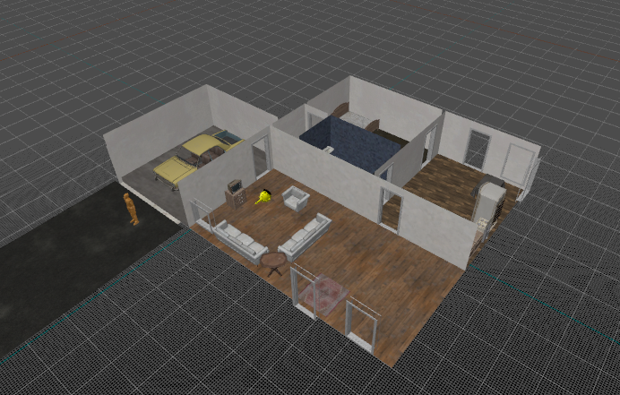
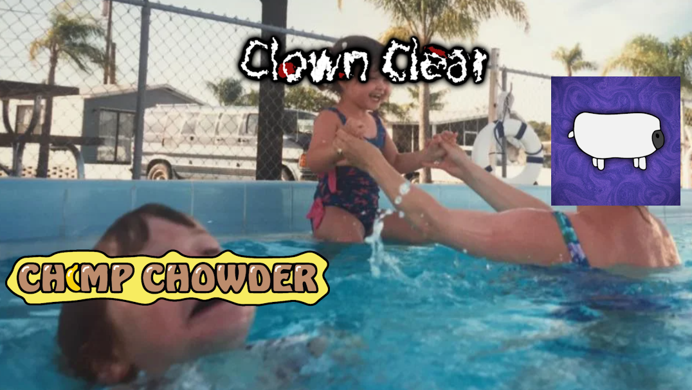

===
title: Clowns, Candy, Chimps, and Cranes
date: August 18, 2023
time: (6:27 PM EST)
tags: News & Dev
thumbnail: ../../../images/Blogs/ClownsCandyChimpsCranes/ChimpChowderNeglect.png
===

Hello and welcome back to the official FawaStudios™ blog. It’s been a while once again, so I just want to give some information on the progress and plans for some of the games I’m working on — or planning to work on.

<h2 class="blog-subpage-header">Clown Clear</h2>

Development for *Clown Clear* has been a bit chaotic, but I’m working on smoothing things out. I also want to be a little more strict with myself in the upcoming months so I can make as much progress as fast as possible. I've been addressing a few problems and plan to share more art-related content on my Discord, Twitter (or X 🤓), and this blog.

Regarding the character reveals that I intended to post a while back, most of the work is complete — except for the rendered scenes, which proved to be a little overwhelming. However, with my recent surge of motivation, I'm hoping to work on them in the upcoming weeks.

In recent news, my persistent search for a Hammer-esque level design tool has finally paid off after months of aggressive scouring on the internet. I discovered that the Source 2 Hammer editor has built-in export functionality, and after using it for a mere 30 minutes I realized that it was 100% the best tool I’ve used so far. This should make progress a lot faster in the level design department.

  
*(Image of a W.I.P house in HL:A Hammer — obviously not permanent models since I’d be sued into oblivion)*

<h2 class="blog-subpage-header">Click or Treat 2</h2>

I’m still not sure whether to call this an update or a sequel, but I’ve started development on it with the latest *Click or Treat* update as a base. This has been pretty slow, but I’m planning on having it out by Halloween, and increasing development time as that deadline gets closer.

Content-wise, I’m working on getting things that I failed to add to the previous updates into this one, as well as some cool new mechanics. Here’s a list of the most notable additions, which may or may not be cut or altered:

- **Player House(s)** – Interactable items, maybe even purchasable decorations?
- **Costumes** – Serves as upgrades, mix & match perks?
- **Devil Deals** – Permanent upgrades, uses souls
- **Random Buildings** – Explorable, slightly procedural, obtainable loot?
- **More Variety** – Random houses with more variety in doors, outside decorations, etc.
- **World / Lore** – Viewable world progression as monsters become more prominent?
- **Achievements** – This is surprisingly difficult

I’ll try to go more in depth on these changes later on and get feedback — but these are just some things I’m conceptualizing.

<h2 class="blog-subpage-header">Chimp Chowder</h2>

Currently *Chimp Chowder*, the beloved chowder-feeding chimp simulator seen in the meme above, has been navigating its way through the treacherous depths of development hell. While this is undeniably tragic, it’s temporary — and I haven’t completely abandoned it yet. I’m still focusing most of my efforts on *Clown Clear*, but hopefully sometime soon I’ll work on finally getting it out there.

For transparency’s sake, here’s a list of things I need to do before I can launch the game on Steam and Itch.io, preferably right after the pages go public:

- **Skin System** – Need to rewrite the skin system so I can easily add new skins while giving players a sense of achievement. This has given me trouble in the past, but it shouldn't be too difficult.
- **Level Design** – The map is properly scaled, but I still need to add various props and fix up some messy looking textures.
- **Toon Shader?** – This one has been giving me a lot of problems, and I’m still not entirely sure if it’s the right thing to do. It’ll be the most time-consuming part, but I think it’ll really pay off.
- **Model Polish** – To have a skin system, I need to work on polishing the current chimp model. Currently, the UVs, topology, etc., are suboptimal, and I’d like to fix those up before release.

The game might release in early access so I can add new modes and features based on community feedback — but it’ll definitely be in a playable state. With the skin system, I’ll also try to have regular-ish updates with new skins to unlock.

<h2 class="blog-subpage-header">Mr. Crane</h2>

*Mr. Crane* is a Halloween game I planned on making with a strict deadline, right around my introduction to Unreal Engine 5. Predictably, this didn’t go as well as I expected, and I had to cancel it. Now that I’m more experienced with the engine, I’d like to revisit it — possibly in time for Halloween this year — assuming *Click or Treat 2*, or life, doesn’t get in the way.

I might change the style to be 2D rather than 3D though. I can always have a 3D sequel if I ever feel like it — lol. As a wise man once said, “I would rather have a finished 2D game than an unfinished 3D game.” That wise man… was me.

<h2 class="blog-subpage-header">Conclusion</h2>

And that concludes today's news. I’ll make an effort to get more blog posts out on various *Clown Clear* topics as well as miscellaneous updates soon. But for now, I hope this glimpse of FawaStudios™ (is this joke getting stale yet?) insider information was valuable in some way.

Bye bye! Follow my Twitter, join my Discord, admire my new “News” page, and take care!